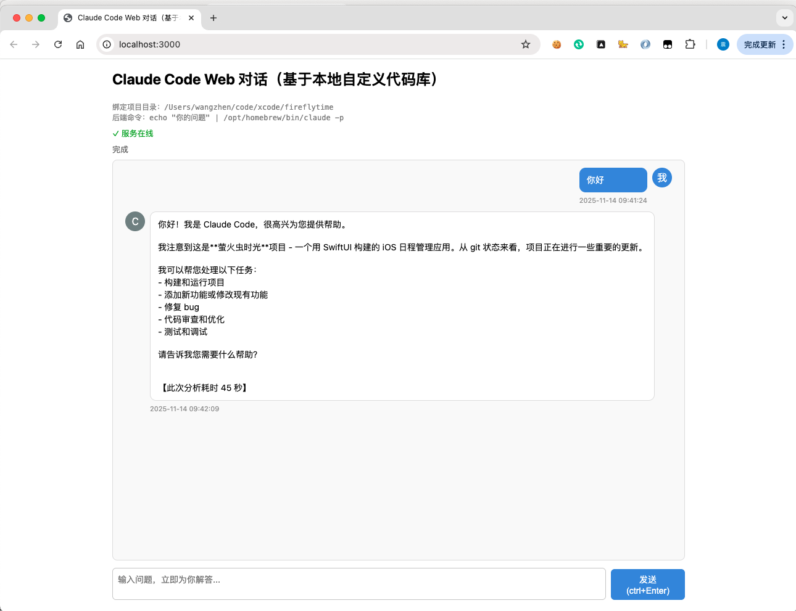
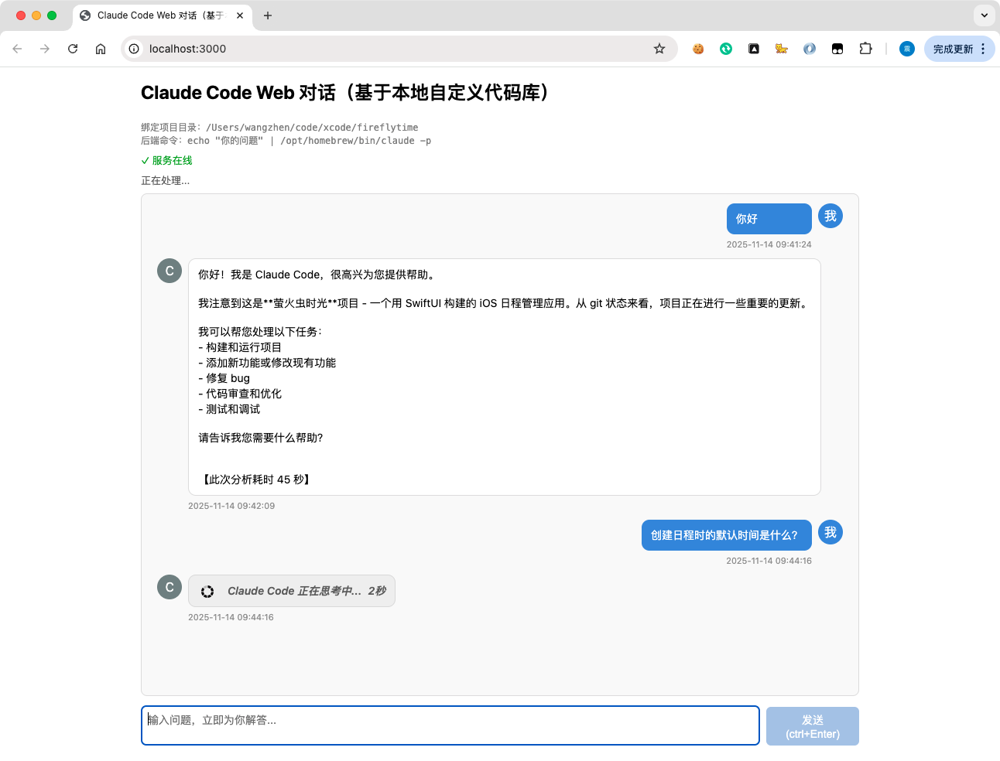
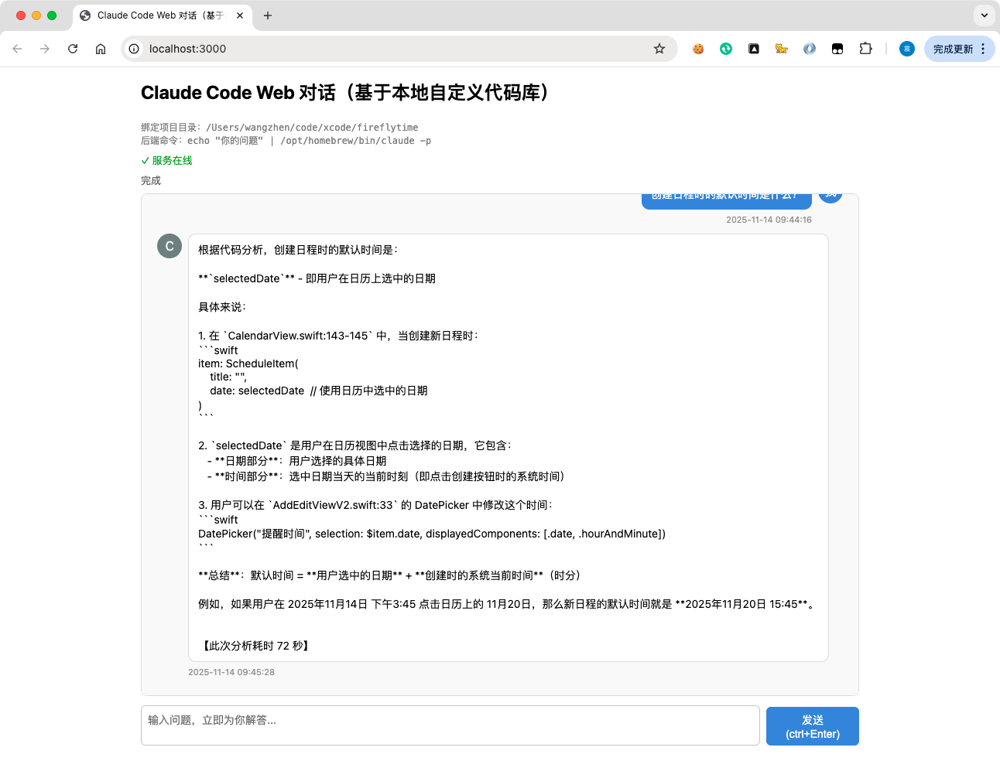

# Claude Code Web UI

一个为 Claude Code CLI 提供的简洁 Web 交互界面，让你可以通过浏览器与 Claude Code 进行对话，分析本地代码库。



## 项目简介

Claude Code 是 Anthropic 提供的强大 AI 编程助手命令行工具。本项目为其提供了一个友好的 Web UI，使用户可以：

- 通过浏览器与 Claude Code 交互
- 基于指定的本地代码库进行代码分析
- 获得实时的代码问答和建议
- 保留对话历史（会话级别）

## 功能特点

- 🎨 简洁的聊天界面设计
- 💬 实时问答交互
- ⏱️ 显示每次分析耗时
- 🔄 Loading 状态提示
- 📝 对话历史记录（页面刷新后清空）
- ⌨️ 快捷键支持（Ctrl/Cmd + Enter 发送）

## 技术栈

- **后端**: Node.js + Express
- **前端**: 原生 HTML/CSS/JavaScript（无框架依赖）
- **CLI 集成**: 通过 child_process 调用 Claude Code CLI

## 系统要求

- Node.js 14.0 或更高版本
- 已安装 Claude Code CLI
- macOS / Linux / Windows

## 快速开始

### 1. 克隆项目

```bash
git clone https://github.com/thebigboy/claude-web-final.git
cd claude-web-final
```

### 2. 安装依赖

```bash
npm install
```

### 3. 配置路径

打开 `server.js`，修改以下配置：

```javascript
// 你的本地代码库路径（Claude Code 将分析此目录）
const PROJECT_ROOT = '/Users/your-username/your-project';

// Claude CLI 可执行文件的绝对路径
const CLAUDE_CMD = '/opt/homebrew/bin/claude';
```

**查找 Claude CLI 路径**：
```bash
which claude
```

### 4. 启动服务

```bash
npm start
```

服务器将在 `http://localhost:3000` 启动。

### 5. 开始使用

在浏览器中访问 `http://localhost:3000`，即可开始与 Claude Code 对话！

## 使用示例

你可以向 Claude Code 提问关于你配置的代码库的任何问题，例如：

- "这个项目的整体架构是什么？"
- "请帮我分析 UserController 的实现逻辑"
- "如何优化这个项目的性能？"
- "帮我找出潜在的安全问题"

## API 接口

### GET /api/health

健康检查接口，返回当前配置信息。

**响应示例**：
```json
{
  "ok": true,
  "projectRoot": "/path/to/your/project",
  "cmd": "/path/to/claude"
}
```

### POST /api/ask

提交问题给 Claude Code 进行分析。

**请求**：
```json
{
  "question": "你的问题"
}
```

**响应（成功）**：
```json
{
  "answer": "Claude Code 的回答内容",
  "stderr": ""
}
```

**响应（失败）**：
```json
{
  "error": "错误信息",
  "detail": "详细错误描述"
}
```

## 项目结构

```
claude-code-web/
├── server.js           # Express 服务器主文件
├── package.json        # 项目依赖配置
├── public/             # 静态资源目录
│   ├── index.html      # Web UI 主页面
│   └── images/         # 图片资源
│       └── loading.gif # 加载动画
└── README.md           # 项目说明文档
```

## 配置说明

### 端口配置

默认端口为 3000，如需修改，编辑 `server.js` 的第 131 行：

```javascript
const PORT = 3000; // 改为你想要的端口
```

### 超时配置

默认超时时间为 5 分钟，如需调整，修改 `server.js` 的第 115 行：

```javascript
const KILL_TIMEOUT_MS = 5 * 60 * 1000; // 毫秒
```

## 注意事项

1. **路径配置**：启动前务必正确配置 `PROJECT_ROOT` 和 `CLAUDE_CMD`
2. **Claude Code 认证**：确保 Claude Code CLI 已正确配置并可用
3. **项目权限**：确保 Node.js 进程有权限访问配置的项目目录
4. **会话持久化**：当前版本不支持会话持久化，刷新页面会丢失对话历史
5. **安全性**：本项目仅适用于本地开发环境，不建议直接部署到公网

## 常见问题

### Q: 提示"启动 Claude 子进程失败"

A: 检查 `CLAUDE_CMD` 路径是否正确，使用 `which claude` 确认 CLI 安装位置。

### Q: 一直显示"正在思考中"

A: 检查配置的项目路径是否存在，以及 Claude CLI 是否有权限访问该目录。

### Q: 如何查看详细的调试信息？

A: 运行服务器后，所有日志会输出到终端，包括 stdout 和 stderr。

## 开发计划

- [ ] 支持会话持久化（数据库存储）
- [ ] 支持多用户和多项目配置
- [ ] 添加 Markdown 渲染支持
- [ ] 支持代码高亮显示
- [ ] 添加导出对话功能
- [ ] 支持上传文件进行分析

## 许可证

MIT License

## 贡献

欢迎提交 Issue 和 Pull Request！

## 联系方式

如有问题或建议，请通过以下方式联系：

- 提交 GitHub Issue
- 发送邮件至: mengjunxiaoxiang@163.com

---

**⭐ 如果这个项目对你有帮助，欢迎 Star 支持！**
